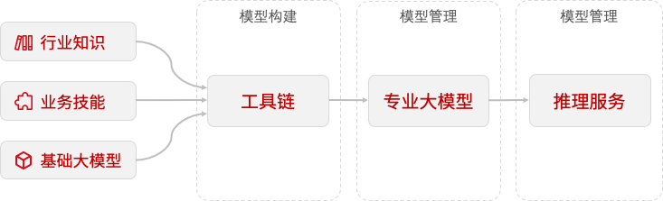

---
专业大模型定制平台在AI大模型微调开发过程中扮演着至关重要的角色。平台将各种工具、框架、库等集成在产品中，从而简化了开发流程，提高了开发效率。通过简单易用的方式，使得开发者能够更快速地构建和部署高质量的大模型。

### 功能概览

### 主要功能
* 知识集

平台将数据集统称为“知识”，旨在帮助组织机构更有效地收集、组织、利用和保护其知识资产。平台支持对数据进行管理，编辑，标注等功能。

* 技能库

技能库管理着用于扩展专属定制模型功能的工具的集合。这些工具为开发者提供了一系列的业务能力，使得开发者可以更轻松地构建智能应用程序。开发者可以通过技能库轻松地扩展他们的应用程序的功能，从而提供更智能、更高效的用户体验。

* 专属定制模型

基于超大规模数据集的预训练模型，为开发者提供了一种快速、高效、高精度的模型获取方式。开发者可以轻松地构建各种智能应用程序，满足不同的业务需求。